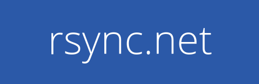

## It's your data. Keep it that way.


borgmatic is simple, configuration-driven backup software for servers and
workstations. Protect your files with client-side encryption. Backup your
databases too. Monitor it all with integrated third-party services.

Here's an example configuration file:

```yaml
location:
    # List of source directories to backup.
    source_directories:
        - /home
        - /etc

    # Paths of local or remote repositories to backup to.
    repositories:
        - 1234@usw-s001.rsync.net:backups.borg
        - k8pDxu32@k8pDxu32.repo.borgbase.com:repo
        - /var/lib/backups/local.borg

retention:
    # Retention policy for how many backups to keep.
    keep_daily: 7
    keep_weekly: 4
    keep_monthly: 6

consistency:
    # List of checks to run to validate your backups.
    checks:
        - repository
        - archives

hooks:
    # Custom preparation scripts to run.
    before_backup:
        - prepare-for-backup.sh

    # Databases to dump and include in backups.
    postgresql_databases:
        - name: users

    # Third-party services to notify you if backups aren't happening.
    healthchecks: https://hc-ping.com/be067061-cf96-4412-8eae-62b0c50d6a8c
```

Want to see borgmatic in action? Check out the <a
href="https://asciinema.org/a/203761" target="_blank">screencast</a>.

<script src="https://asciinema.org/a/203761.js" id="asciicast-203761" async></script>

borgmatic is powered by [Borg Backup](https://www.borgbackup.org/).

## Integrations

<a href="https://www.postgresql.org/"></a>&nbsp;&nbsp;&nbsp;&nbsp;&nbsp;
<a href="https://www.mysql.com/"></a>&nbsp;&nbsp;&nbsp;&nbsp;&nbsp;
<a href="https://mariadb.com/"></a>&nbsp;&nbsp;&nbsp;&nbsp;&nbsp;
<a href="https://healthchecks.io/"></a>&nbsp;&nbsp;&nbsp;&nbsp;&nbsp;
<a href="https://cronitor.io/"></a>&nbsp;&nbsp;&nbsp;&nbsp;&nbsp;
<a href="https://cronhub.io/"></a>&nbsp;&nbsp;&nbsp;&nbsp;&nbsp;
<a href="https://www.pagerduty.com/"></a>&nbsp;&nbsp;&nbsp;&nbsp;&nbsp;
<a href="https://www.rsync.net/cgi-bin/borg.cgi?campaign=borg&adgroup=borgmatic"></a>&nbsp;&nbsp;&nbsp;&nbsp;&nbsp;
<a href="https://www.borgbase.com/?utm_source=borgmatic"></a>&nbsp;&nbsp;&nbsp;&nbsp;&nbsp;


## How-to guides

 * [Set up backups with borgmatic](https://torsion.org/borgmatic/docs/how-to/set-up-backups/) ⬅ *Start here!*
 * [Make per-application backups](https://torsion.org/borgmatic/docs/how-to/make-per-application-backups/)
 * [Deal with very large backups](https://torsion.org/borgmatic/docs/how-to/deal-with-very-large-backups/)
 * [Inspect your backups](https://torsion.org/borgmatic/docs/how-to/inspect-your-backups/)
 * [Monitor your backups](https://torsion.org/borgmatic/docs/how-to/monitor-your-backups/)
 * [Extract a backup](https://torsion.org/borgmatic/docs/how-to/extract-a-backup/)
 * [Backup your databases](https://torsion.org/borgmatic/docs/how-to/backup-your-databases/)
 * [Add preparation and cleanup steps to backups](https://torsion.org/borgmatic/docs/how-to/add-preparation-and-cleanup-steps-to-backups/)
 * [Backup to a removable drive or an intermittent server](https://torsion.org/borgmatic/docs/how-to/backup-to-a-removable-drive-or-an-intermittent-server/)
 * [Upgrade borgmatic](https://torsion.org/borgmatic/docs/how-to/upgrade/)
 * [Develop on borgmatic](https://torsion.org/borgmatic/docs/how-to/develop-on-borgmatic/)


## Reference guides

 * [borgmatic configuration reference](https://torsion.org/borgmatic/docs/reference/configuration/)
 * [borgmatic command-line reference](https://torsion.org/borgmatic/docs/reference/command-line/)


## Hosting providers

Need somewhere to store your encrypted offsite backups? The following hosting
providers include specific support for Borg/borgmatic. Using these links and
services helps support borgmatic development and hosting. (These are referral
links, but without any tracking scripts or cookies.)

<ul>
 <li class="referral"><a href="https://www.rsync.net/cgi-bin/borg.cgi?campaign=borg&adgroup=borgmatic">rsync.net</a>: Cloud Storage provider with full support for borg and any other SSH/SFTP tool</li>
 <li class="referral"><a href="https://www.borgbase.com/?utm_source=borgmatic">BorgBase</a>: Borg hosting service with support for monitoring, 2FA, and append-only repos</li>
</ul>

## Support and contributing

### Issues

You've got issues? Or an idea for a feature enhancement? We've got an [issue
tracker](https://projects.torsion.org/witten/borgmatic/issues). In order to
create a new issue or comment on an issue, you'll need to [login
first](https://projects.torsion.org/user/login). Note that you can login with
an existing GitHub account if you prefer.

If you'd like to chat with borgmatic developers or users, head on over to the
`#borgmatic` IRC channel on Freenode, either via <a
href="https://webchat.freenode.net/?channels=borgmatic">web chat</a> or a
native <a href="irc://chat.freenode.net:6697">IRC client</a>.

Also see the [security
policy](https://torsion.org/borgmatic/docs/security-policy/) for any security
issues.

Other questions or comments? Contact
[witten@torsion.org](mailto:witten@torsion.org).


### Contributing

borgmatic is hosted at <https://torsion.org/borgmatic> with [source code
available](https://projects.torsion.org/witten/borgmatic), and is also
mirrored on [GitHub](https://github.com/witten/borgmatic) for convenience.

borgmatic is licensed under the GNU General Public License version 3 or any
later version.

If you'd like to contribute to borgmatic development, please feel free to
submit a [Pull Request](https://projects.torsion.org/witten/borgmatic/pulls)
or open an [issue](https://projects.torsion.org/witten/borgmatic/issues) first
to discuss your idea. We also accept Pull Requests on GitHub, if that's more
your thing. In general, contributions are very welcome. We don't bite! 

Also, please check out the [borgmatic development
how-to](https://torsion.org/borgmatic/docs/how-to/develop-on-borgmatic/) for
info on cloning source code, running tests, etc.

<a href="https://build.torsion.org/witten/borgmatic" alt="build status"></a>

