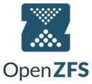
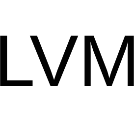
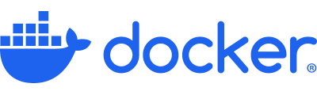
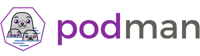
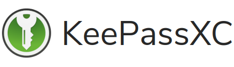

## It's your data. Keep it that way.


borgmatic is simple, configuration-driven backup software for servers and
workstations. Protect your files with client-side encryption. Backup your
databases too. Monitor it all with integrated third-party services.

The canonical home of borgmatic is at <a href="https://torsion.org/borgmatic">https://torsion.org/borgmatic/</a>

Here's an example configuration file:

```yaml
# List of source directories to backup.
source_directories:
    - /home
    - /etc

# Paths of local or remote repositories to backup to.
repositories:
    - path: ssh://k8pDxu32@k8pDxu32.repo.borgbase.com/./repo
      label: borgbase
    - path: /var/lib/backups/local.borg
      label: local

# Retention policy for how many backups to keep.
keep_daily: 7
keep_weekly: 4
keep_monthly: 6

# List of checks to run to validate your backups.
checks:
    - name: repository
    - name: archives
      frequency: 2 weeks

# Custom preparation scripts to run.
commands:
    - before: action
      when: [create]
      run: [prepare-for-backup.sh]

# Databases to dump and include in backups.
postgresql_databases:
    - name: users

# Third-party services to notify you if backups aren't happening.
healthchecks:
    ping_url: https://hc-ping.com/be067061-cf96-4412-8eae-62b0c50d6a8c
```

borgmatic is powered by [Borg Backup](https://www.borgbackup.org/).

## Integrations

### Data

<a href="https://www.postgresql.org/"></a>
<a href="https://www.mysql.com/"></a>
<a href="https://mariadb.com/"></a>
<a href="https://www.mongodb.com/"></a>
<a href="https://sqlite.org/"></a>
<a href="https://openzfs.org/"></a>
<a href="https://btrfs.readthedocs.io/"></a>
<a href="https://sourceware.org/lvm2/"></a>
<a href="https://rclone.org"></a>
<a href="https://www.borgbase.com/?utm_source=borgmatic"></a>


### Monitoring

<a href="https://healthchecks.io/"></a>
<a href="https://uptime.kuma.pet/"></a>
<a href="https://cronitor.io/"></a>
<a href="https://cronhub.io/"></a>
<a href="https://www.pagerduty.com/"></a>
<a href="https://www.pushover.net/"></a>
<a href="https://ntfy.sh/"></a>
<a href="https://grafana.com/oss/loki/"></a>
<a href="https://github.com/caronc/apprise/wiki"></a>
<a href="https://www.zabbix.com/"></a>
<a href="https://sentry.io/"></a>


### Credentials

<a href="https://systemd.io/"></a>
<a href="https://www.docker.com/"></a>
<a href="https://podman.io/"></a>
<a href="https://keepassxc.org/"></a>


## Getting started

Your first step is to [install and configure
borgmatic](https://torsion.org/borgmatic/docs/how-to/set-up-backups/).

For additional documentation, check out the links above (left panel on wide screens)
for <a href="https://torsion.org/borgmatic/#documentation">borgmatic how-to and
reference guides</a>.


## Hosting providers

Need somewhere to store your encrypted off-site backups? The following hosting
providers include specific support for Borg/borgmatic—and fund borgmatic
development and hosting when you use these referral links to sign up:

<ul>
 <li class="referral"><a href="https://www.borgbase.com/?utm_source=borgmatic">BorgBase</a>: Borg hosting service with support for monitoring, 2FA, and append-only repos</li>
 <li class="referral"><a href="https://hetzner.cloud/?ref=v9dOJ98Ic9I8">Hetzner</a>: A "storage box" that includes support for Borg</li>
</ul>

Additionally, rsync.net has a compatible storage offering, but does not fund
borgmatic development or hosting.

## Support and contributing

### Issues

Are you experiencing an issue with borgmatic? Or do you have an idea for a
feature enhancement? Head on over to our [issue
tracker](https://projects.torsion.org/borgmatic-collective/borgmatic/issues).
In order to create a new issue or add a comment, you'll need to
[register](https://projects.torsion.org/user/sign_up?invite_code=borgmatic)
first. If you prefer to use an existing GitHub account, you can skip account
creation and [login directly](https://projects.torsion.org/user/login).

Also see the [security
policy](https://torsion.org/borgmatic/docs/security-policy/) for any security
issues.


### Social

Follow <a rel="me" href="https://floss.social/@borgmatic">borgmatic on
Mastodon</a>.


### Chat

To chat with borgmatic developers or users, check out the `#borgmatic`
IRC channel on Libera Chat, either via <a
href="https://web.libera.chat/#borgmatic">web chat</a> or a native <a
href="ircs://irc.libera.chat:6697">IRC client</a>. If you don't get a response
right away, please hang around a while—or file a ticket instead.


### Other

Other questions or comments? Contact
[witten@torsion.org](mailto:witten@torsion.org).


### Contributing

borgmatic [source code is
available](https://projects.torsion.org/borgmatic-collective/borgmatic) and also
has a read-only mirror on
[GitHub](https://github.com/borgmatic-collective/borgmatic) for convenience.

borgmatic is licensed under the GNU General Public License version 3 or any
later version.

If you'd like to contribute to borgmatic development, please feel free to submit
a [pull
request](https://projects.torsion.org/borgmatic-collective/borgmatic/pulls) or
open an
[issue](https://projects.torsion.org/borgmatic-collective/borgmatic/issues) to
discuss your idea. Note that you'll need to
[register](https://projects.torsion.org/user/sign_up?invite_code=borgmatic)
first. In general, contributions are very welcome. We don't bite!

Also, please check out the [borgmatic development
how-to](https://torsion.org/borgmatic/docs/how-to/develop-on-borgmatic/) for
info on cloning source code, running tests, etc.

### Recent contributors

Thanks to all borgmatic contributors! There are multiple ways to contribute to
this project, so the following includes those who have fixed bugs, contributed
features, *or* filed tickets.


