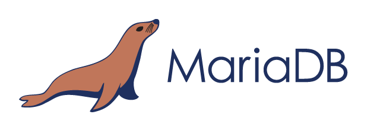
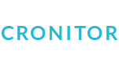
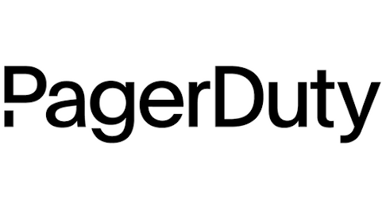
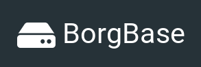

## It's your data. Keep it that way.


borgmatic is simple, configuration-driven backup software for servers and
workstations. Protect your files with client-side encryption. Backup your
databases too. Monitor it all with integrated third-party services.

The canonical home of borgmatic is at <a href="https://torsion.org/borgmatic">https://torsion.org/borgmatic</a>.

Here's an example configuration file:

```yaml
location:
    # List of source directories to backup.
    source_directories:
        - /home
        - /etc

    # Paths of local or remote repositories to backup to.
    repositories:
        - 1234@usw-s001.rsync.net:backups.borg
        - k8pDxu32@k8pDxu32.repo.borgbase.com:repo
        - /var/lib/backups/local.borg

retention:
    # Retention policy for how many backups to keep.
    keep_daily: 7
    keep_weekly: 4
    keep_monthly: 6

consistency:
    # List of checks to run to validate your backups.
    checks:
        - repository
        - archives

hooks:
    # Custom preparation scripts to run.
    before_backup:
        - prepare-for-backup.sh

    # Databases to dump and include in backups.
    postgresql_databases:
        - name: users

    # Third-party services to notify you if backups aren't happening.
    healthchecks: https://hc-ping.com/be067061-cf96-4412-8eae-62b0c50d6a8c
```

Want to see borgmatic in action? Check out the <a
href="https://asciinema.org/a/203761?autoplay=1" target="_blank">screencast</a>.

<a href="https://asciinema.org/a/203761?autoplay=1" target="_blank"></a>

borgmatic is powered by [Borg Backup](https://www.borgbackup.org/).

## Integrations

<a href="https://www.postgresql.org/"></a>&nbsp;&nbsp;&nbsp;&nbsp;&nbsp;
<a href="https://www.mysql.com/"></a>&nbsp;&nbsp;&nbsp;&nbsp;&nbsp;
<a href="https://mariadb.com/"></a>&nbsp;&nbsp;&nbsp;&nbsp;&nbsp;
<a href="https://www.mongodb.com/"></a>&nbsp;&nbsp;&nbsp;&nbsp;&nbsp;
<a href="https://healthchecks.io/"></a>&nbsp;&nbsp;&nbsp;&nbsp;&nbsp;
<a href="https://cronitor.io/"></a>&nbsp;&nbsp;&nbsp;&nbsp;&nbsp;
<a href="https://cronhub.io/"></a>&nbsp;&nbsp;&nbsp;&nbsp;&nbsp;
<a href="https://www.pagerduty.com/"></a>&nbsp;&nbsp;&nbsp;&nbsp;&nbsp;
<a href="https://www.borgbase.com/?utm_source=borgmatic"></a>&nbsp;&nbsp;&nbsp;&nbsp;&nbsp;


## Getting started

Your first step is to [install and configure
borgmatic](https://torsion.org/borgmatic/docs/how-to/set-up-backups/).

For additional documentation, check out the links above for <a
href="https://torsion.org/borgmatic/#documentation">borgmatic how-to and
reference guides</a>.


## Hosting providers

Need somewhere to store your encrypted off-site backups? The following hosting
providers include specific support for Borg/borgmatic—and fund borgmatic
development and hosting when you use these links to sign up. (These are
referral links, but without any tracking scripts or cookies.)

<ul>
 <li class="referral"><a href="https://www.borgbase.com/?utm_source=borgmatic">BorgBase</a>: Borg hosting service with support for monitoring, 2FA, and append-only repos</li>
</ul>

Additionally, [rsync.net](https://www.rsync.net/products/borg.html) and
[Hetzner](https://www.hetzner.com/storage/storage-box) have compatible storage
offerings, but do not currently fund borgmatic development or hosting.

## Support and contributing

### Issues

You've got issues? Or an idea for a feature enhancement? We've got an [issue
tracker](https://projects.torsion.org/borgmatic-collective/borgmatic/issues). In order to
create a new issue or comment on an issue, you'll need to [login
first](https://projects.torsion.org/user/login). Note that you can login with
an existing GitHub account if you prefer.

If you'd like to chat with borgmatic developers or users, head on over to the
`#borgmatic` IRC channel on Libera Chat, either via <a
href="https://web.libera.chat/#borgmatic">web chat</a> or a
native <a href="ircs://irc.libera.chat:6697">IRC client</a>. If you
don't get a response right away, please hang around a while—or file a ticket
instead.

Also see the [security
policy](https://torsion.org/borgmatic/docs/security-policy/) for any security
issues.

Other questions or comments? Contact
[witten@torsion.org](mailto:witten@torsion.org).


### Contributing

borgmatic [source code is
available](https://projects.torsion.org/borgmatic-collective/borgmatic) and is also mirrored
on [GitHub](https://github.com/borgmatic-collective/borgmatic) for convenience.

borgmatic is licensed under the GNU General Public License version 3 or any
later version.

If you'd like to contribute to borgmatic development, please feel free to
submit a [Pull Request](https://projects.torsion.org/borgmatic-collective/borgmatic/pulls)
or open an [issue](https://projects.torsion.org/borgmatic-collective/borgmatic/issues) first
to discuss your idea. We also accept Pull Requests on GitHub, if that's more
your thing. In general, contributions are very welcome. We don't bite! 

Also, please check out the [borgmatic development
how-to](https://torsion.org/borgmatic/docs/how-to/develop-on-borgmatic/) for
info on cloning source code, running tests, etc.

<a href="https://build.torsion.org/borgmatic-collective/borgmatic" alt="build status"></a>

